# 单变量分析报告
## 数值型变量间相关性
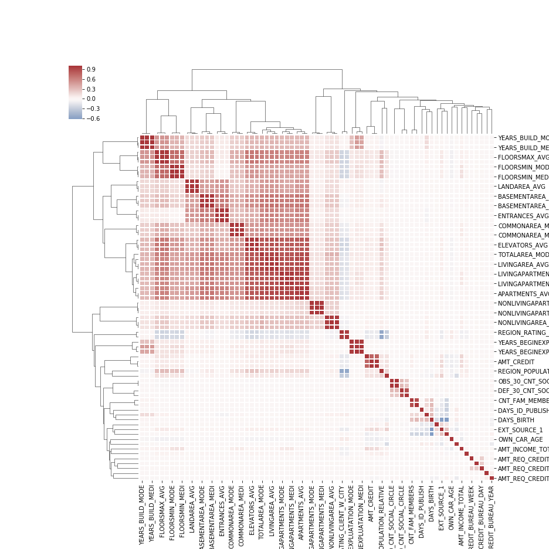
## AMT_INCOME_TOTAL(数值型变量)
### 统计量
取值范围：25650.00 ~ 117000000.00
缺失数量：0(0.00%)
均值：168797.92		中位数：147150.00
标准差：237123.15		绝对离差：66226.35
偏度：391.56		峰度：191786.55
与预测变量的相关性：-0.003982
|min|25%|50%|75%|max|
|-:|-:|-:|-:|-:|
|25650.00|112500.00|147150.00|202500.00|117000000.00|
### 概率密度分布

## AMT_CREDIT(数值型变量)
### 统计量
取值范围：45000.00 ~ 4050000.00
缺失数量：0(0.00%)
均值：599026.00		中位数：513531.00
标准差：402490.78		绝对离差：316583.74
偏度：1.23		峰度：1.93
与预测变量的相关性：-0.030369
|min|25%|50%|75%|max|
|-:|-:|-:|-:|-:|
|45000.00|270000.00|513531.00|808650.00|4050000.00|
### 概率密度分布

## AMT_ANNUITY(数值型变量)
### 统计量
取值范围：1615.50 ~ 258025.50
缺失数量：12(0.00%)
均值：27108.57		中位数：24903.00
标准差：14493.74		绝对离差：10975.43
偏度：1.58		峰度：7.71
与预测变量的相关性：-0.012817
|min|25%|50%|75%|max|
|-:|-:|-:|-:|-:|
|1615.50|16524.00|24903.00|34596.00|258025.50|
### 概率密度分布

## AMT_GOODS_PRICE(数值型变量)
### 统计量
取值范围：40500.00 ~ 4050000.00
缺失数量：278(0.09%)
均值：538396.21		中位数：450000.00
标准差：369446.46		绝对离差：288576.15
偏度：1.35		峰度：2.43
与预测变量的相关性：-0.039645
|min|25%|50%|75%|max|
|-:|-:|-:|-:|-:|
|40500.00|238500.00|450000.00|679500.00|4050000.00|
### 概率密度分布

## REGION_POPULATION_RELATIVE(数值型变量)
### 统计量
取值范围：0.00 ~ 0.07
缺失数量：0(0.00%)
均值：0.02		中位数：0.02
标准差：0.01		绝对离差：0.01
偏度：1.49		峰度：3.26
与预测变量的相关性：-0.037227
|min|25%|50%|75%|max|
|-:|-:|-:|-:|-:|
|0.00|0.01|0.02|0.03|0.07|
### 概率密度分布

## DAYS_REGISTRATION(数值型变量)
### 统计量
取值范围：-24672.00 ~ 0.00
缺失数量：0(0.00%)
均值：-4986.12		中位数：-4504.00
标准差：3522.89		绝对离差：2915.44
偏度：-0.59		峰度：-0.32
与预测变量的相关性：0.041975
|min|25%|50%|75%|max|
|-:|-:|-:|-:|-:|
|-24672.00|-7479.50|-4504.00|-2010.00|0.00|
### 概率密度分布

## OWN_CAR_AGE(数值型变量)
### 统计量
取值范围：0.00 ~ 91.00
缺失数量：202929(65.99%)
均值：12.06		中位数：9.00
标准差：11.94		绝对离差：7.67
偏度：2.75		峰度：9.21
与预测变量的相关性：0.037612
|min|25%|50%|75%|max|
|-:|-:|-:|-:|-:|
|0.00|5.00|9.00|15.00|91.00|
### 概率密度分布

## CNT_FAM_MEMBERS(数值型变量)
### 统计量
取值范围：1.00 ~ 20.00
缺失数量：2(0.00%)
均值：2.15		中位数：2.00
标准差：0.91		绝对离差：0.67
偏度：0.99		峰度：2.80
与预测变量的相关性：0.009308
|min|25%|50%|75%|max|
|-:|-:|-:|-:|-:|
|1.00|2.00|2.00|3.00|20.00|
### 概率密度分布
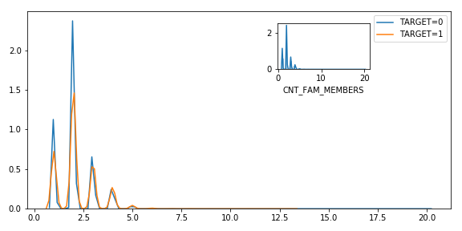
## EXT_SOURCE_1(数值型变量)
### 统计量
取值范围：0.01 ~ 0.96
缺失数量：173378(56.38%)
均值：0.50		中位数：0.51
标准差：0.21		绝对离差：0.18
偏度：-0.07		峰度：-0.97
与预测变量的相关性：-0.155317
|min|25%|50%|75%|max|
|-:|-:|-:|-:|-:|
|0.01|0.33|0.51|0.68|0.96|
### 概率密度分布

## EXT_SOURCE_2(数值型变量)
### 统计量
取值范围：0.00 ~ 0.85
缺失数量：660(0.21%)
均值：0.51		中位数：0.57
标准差：0.19		绝对离差：0.16
偏度：-0.79		峰度：-0.27
与预测变量的相关性：-0.160472
|min|25%|50%|75%|max|
|-:|-:|-:|-:|-:|
|0.00|0.39|0.57|0.66|0.85|
### 概率密度分布
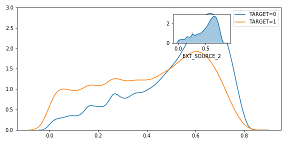
## EXT_SOURCE_3(数值型变量)
### 统计量
取值范围：0.00 ~ 0.90
缺失数量：60965(19.83%)
均值：0.51		中位数：0.54
标准差：0.19		绝对离差：0.16
偏度：-0.41		峰度：-0.66
与预测变量的相关性：-0.178919
|min|25%|50%|75%|max|
|-:|-:|-:|-:|-:|
|0.00|0.37|0.54|0.67|0.90|
### 概率密度分布

## APARTMENTS_AVG(数值型变量)
### 统计量
取值范围：0.00 ~ 1.00
缺失数量：156061(50.75%)
均值：0.12		中位数：0.09
标准差：0.11		绝对离差：0.07
偏度：2.64		峰度：11.39
与预测变量的相关性：-0.029498
|min|25%|50%|75%|max|
|-:|-:|-:|-:|-:|
|0.00|0.06|0.09|0.15|1.00|
### 概率密度分布

## BASEMENTAREA_AVG(数值型变量)
### 统计量
取值范围：0.00 ~ 1.00
缺失数量：179943(58.52%)
均值：0.09		中位数：0.08
标准差：0.08		绝对离差：0.05
偏度：3.57		峰度：25.93
与预测变量的相关性：-0.022746
|min|25%|50%|75%|max|
|-:|-:|-:|-:|-:|
|0.00|0.04|0.08|0.11|1.00|
### 概率密度分布

## YEARS_BEGINEXPLUATATION_AVG(数值型变量)
### 统计量
取值范围：0.00 ~ 1.00
缺失数量：150007(48.78%)
均值：0.98		中位数：0.98
标准差：0.06		绝对离差：0.01
偏度：-15.52		峰度：248.18
与预测变量的相关性：-0.009728
|min|25%|50%|75%|max|
|-:|-:|-:|-:|-:|
|0.00|0.98|0.98|0.99|1.00|
### 概率密度分布

## YEARS_BUILD_AVG(数值型变量)
### 统计量
取值范围：0.00 ~ 1.00
缺失数量：204488(66.50%)
均值：0.75		中位数：0.76
标准差：0.11		绝对离差：0.08
偏度：-0.96		峰度：4.40
与预测变量的相关性：-0.022149
|min|25%|50%|75%|max|
|-:|-:|-:|-:|-:|
|0.00|0.69|0.76|0.82|1.00|
### 概率密度分布

## COMMONAREA_AVG(数值型变量)
### 统计量
取值范围：0.00 ~ 1.00
缺失数量：214865(69.87%)
均值：0.04		中位数：0.02
标准差：0.08		绝对离差：0.04
偏度：5.46		峰度：45.99
与预测变量的相关性：-0.018550
|min|25%|50%|75%|max|
|-:|-:|-:|-:|-:|
|0.00|0.01|0.02|0.05|1.00|
### 概率密度分布

## ELEVATORS_AVG(数值型变量)
### 统计量
取值范围：0.00 ~ 1.00
缺失数量：163891(53.30%)
均值：0.08		中位数：0.00
标准差：0.13		绝对离差：0.10
偏度：2.44		峰度：7.87
与预测变量的相关性：-0.034199
|min|25%|50%|75%|max|
|-:|-:|-:|-:|-:|
|0.00|0.00|0.00|0.12|1.00|
### 概率密度分布

## ENTRANCES_AVG(数值型变量)
### 统计量
取值范围：0.00 ~ 1.00
缺失数量：154828(50.35%)
均值：0.15		中位数：0.14
标准差：0.10		绝对离差：0.07
偏度：2.40		峰度：11.59
与预测变量的相关性：-0.019172
|min|25%|50%|75%|max|
|-:|-:|-:|-:|-:|
|0.00|0.07|0.14|0.21|1.00|
### 概率密度分布

## FLOORSMAX_AVG(数值型变量)
### 统计量
取值范围：0.00 ~ 1.00
缺失数量：153020(49.76%)
均值：0.23		中位数：0.17
标准差：0.14		绝对离差：0.12
偏度：1.23		峰度：2.43
与预测变量的相关性：-0.044003
|min|25%|50%|75%|max|
|-:|-:|-:|-:|-:|
|0.00|0.17|0.17|0.33|1.00|
### 概率密度分布

## FLOORSMIN_AVG(数值型变量)
### 统计量
取值范围：0.00 ~ 1.00
缺失数量：208642(67.85%)
均值：0.23		中位数：0.21
标准差：0.16		绝对离差：0.12
偏度：0.95		峰度：1.34
与预测变量的相关性：-0.033614
|min|25%|50%|75%|max|
|-:|-:|-:|-:|-:|
|0.00|0.08|0.21|0.38|1.00|
### 概率密度分布

## LANDAREA_AVG(数值型变量)
### 统计量
取值范围：0.00 ~ 1.00
缺失数量：182590(59.38%)
均值：0.07		中位数：0.05
标准差：0.08		绝对离差：0.05
偏度：4.46		峰度：34.74
与预测变量的相关性：-0.010885
|min|25%|50%|75%|max|
|-:|-:|-:|-:|-:|
|0.00|0.02|0.05|0.09|1.00|
### 概率密度分布

## LIVINGAPARTMENTS_AVG(数值型变量)
### 统计量
取值范围：0.00 ~ 1.00
缺失数量：210199(68.35%)
均值：0.10		中位数：0.08
标准差：0.09		绝对离差：0.06
偏度：3.04		峰度：16.49
与预测变量的相关性：-0.025031
|min|25%|50%|75%|max|
|-:|-:|-:|-:|-:|
|0.00|0.05|0.08|0.12|1.00|
### 概率密度分布

## LIVINGAREA_AVG(数值型变量)
### 统计量
取值范围：0.00 ~ 1.00
缺失数量：154350(50.19%)
均值：0.11		中位数：0.07
标准差：0.11		绝对离差：0.07
偏度：2.85		峰度：12.33
与预测变量的相关性：-0.032997
|min|25%|50%|75%|max|
|-:|-:|-:|-:|-:|
|0.00|0.05|0.07|0.13|1.00|
### 概率密度分布

## NONLIVINGAPARTMENTS_AVG(数值型变量)
### 统计量
取值范围：0.00 ~ 1.00
缺失数量：213514(69.43%)
均值：0.01		中位数：0.00
标准差：0.05		绝对离差：0.01
偏度：15.54		峰度：284.73
与预测变量的相关性：-0.003176
|min|25%|50%|75%|max|
|-:|-:|-:|-:|-:|
|0.00|0.00|0.00|0.00|1.00|
### 概率密度分布

## NONLIVINGAREA_AVG(数值型变量)
### 统计量
取值范围：0.00 ~ 1.00
缺失数量：169682(55.18%)
均值：0.03		中位数：0.00
标准差：0.07		绝对离差：0.04
偏度：6.56		峰度：64.91
与预测变量的相关性：-0.013578
|min|25%|50%|75%|max|
|-:|-:|-:|-:|-:|
|0.00|0.00|0.00|0.03|1.00|
### 概率密度分布

## APARTMENTS_MODE(数值型变量)
### 统计量
取值范围：0.00 ~ 1.00
缺失数量：156061(50.75%)
均值：0.11		中位数：0.08
标准差：0.11		绝对离差：0.07
偏度：2.70		峰度：11.75
与预测变量的相关性：-0.027284
|min|25%|50%|75%|max|
|-:|-:|-:|-:|-:|
|0.00|0.05|0.08|0.14|1.00|
### 概率密度分布

## BASEMENTAREA_MODE(数值型变量)
### 统计量
取值范围：0.00 ~ 1.00
缺失数量：179943(58.52%)
均值：0.09		中位数：0.07
标准差：0.08		绝对离差：0.05
偏度：3.48		峰度：24.43
与预测变量的相关性：-0.019952
|min|25%|50%|75%|max|
|-:|-:|-:|-:|-:|
|0.00|0.04|0.07|0.11|1.00|
### 概率密度分布

## YEARS_BEGINEXPLUATATION_MODE(数值型变量)
### 统计量
取值范围：0.00 ~ 1.00
缺失数量：150007(48.78%)
均值：0.98		中位数：0.98
标准差：0.06		绝对离差：0.01
偏度：-14.76		峰度：219.96
与预测变量的相关性：-0.009036
|min|25%|50%|75%|max|
|-:|-:|-:|-:|-:|
|0.00|0.98|0.98|0.99|1.00|
### 概率密度分布
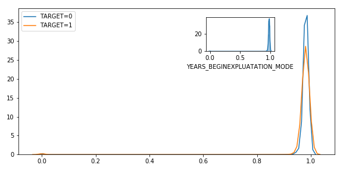
## YEARS_BUILD_MODE(数值型变量)
### 统计量
取值范围：0.00 ~ 1.00
缺失数量：204488(66.50%)
均值：0.76		中位数：0.76
标准差：0.11		绝对离差：0.08
偏度：-1.00		峰度：4.76
与预测变量的相关性：-0.022068
|min|25%|50%|75%|max|
|-:|-:|-:|-:|-:|
|0.00|0.70|0.76|0.82|1.00|
### 概率密度分布
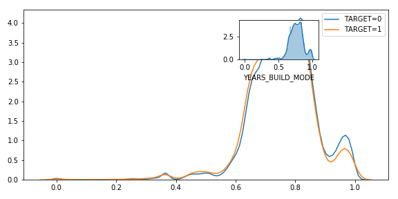
## COMMONAREA_MODE(数值型变量)
### 统计量
取值范围：0.00 ~ 1.00
缺失数量：214865(69.87%)
均值：0.04		中位数：0.02
标准差：0.07		绝对离差：0.04
偏度：5.62		峰度：48.86
与预测变量的相关性：-0.016340
|min|25%|50%|75%|max|
|-:|-:|-:|-:|-:|
|0.00|0.01|0.02|0.05|1.00|
### 概率密度分布

## ELEVATORS_MODE(数值型变量)
### 统计量
取值范围：0.00 ~ 1.00
缺失数量：163891(53.30%)
均值：0.07		中位数：0.00
标准差：0.13		绝对离差：0.10
偏度：2.55		峰度：8.60
与预测变量的相关性：-0.032131
|min|25%|50%|75%|max|
|-:|-:|-:|-:|-:|
|0.00|0.00|0.00|0.12|1.00|
### 概率密度分布

## ENTRANCES_MODE(数值型变量)
### 统计量
取值范围：0.00 ~ 1.00
缺失数量：154828(50.35%)
均值：0.15		中位数：0.14
标准差：0.10		绝对离差：0.07
偏度：2.39		峰度：11.42
与预测变量的相关性：-0.017387
|min|25%|50%|75%|max|
|-:|-:|-:|-:|-:|
|0.00|0.07|0.14|0.21|1.00|
### 概率密度分布

## FLOORSMAX_MODE(数值型变量)
### 统计量
取值范围：0.00 ~ 1.00
缺失数量：153020(49.76%)
均值：0.22		中位数：0.17
标准差：0.14		绝对离差：0.12
偏度：1.24		峰度：2.54
与预测变量的相关性：-0.043226
|min|25%|50%|75%|max|
|-:|-:|-:|-:|-:|
|0.00|0.17|0.17|0.33|1.00|
### 概率密度分布

## FLOORSMIN_MODE(数值型变量)
### 统计量
取值范围：0.00 ~ 1.00
缺失数量：208642(67.85%)
均值：0.23		中位数：0.21
标准差：0.16		绝对离差：0.12
偏度：0.96		峰度：1.35
与预测变量的相关性：-0.032698
|min|25%|50%|75%|max|
|-:|-:|-:|-:|-:|
|0.00|0.08|0.21|0.38|1.00|
### 概率密度分布

## LANDAREA_MODE(数值型变量)
### 统计量
取值范围：0.00 ~ 1.00
缺失数量：182590(59.38%)
均值：0.06		中位数：0.05
标准差：0.08		绝对离差：0.05
偏度：4.38		峰度：33.27
与预测变量的相关性：-0.010174
|min|25%|50%|75%|max|
|-:|-:|-:|-:|-:|
|0.00|0.02|0.05|0.08|1.00|
### 概率密度分布

## LIVINGAPARTMENTS_MODE(数值型变量)
### 统计量
取值范围：0.00 ~ 1.00
缺失数量：210199(68.35%)
均值：0.11		中位数：0.08
标准差：0.10		绝对离差：0.07
偏度：2.90		峰度：14.22
与预测变量的相关性：-0.023393
|min|25%|50%|75%|max|
|-:|-:|-:|-:|-:|
|0.00|0.05|0.08|0.13|1.00|
### 概率密度分布

## LIVINGAREA_MODE(数值型变量)
### 统计量
取值范围：0.00 ~ 1.00
缺失数量：154350(50.19%)
均值：0.11		中位数：0.07
标准差：0.11		绝对离差：0.07
偏度：2.90		峰度：12.46
与预测变量的相关性：-0.030685
|min|25%|50%|75%|max|
|-:|-:|-:|-:|-:|
|0.00|0.04|0.07|0.13|1.00|
### 概率密度分布

## NONLIVINGAPARTMENTS_MODE(数值型变量)
### 统计量
取值范围：0.00 ~ 1.00
缺失数量：213514(69.43%)
均值：0.01		中位数：0.00
标准差：0.05		绝对离差：0.01
偏度：16.25		峰度：309.73
与预测变量的相关性：-0.001557
|min|25%|50%|75%|max|
|-:|-:|-:|-:|-:|
|0.00|0.00|0.00|0.00|1.00|
### 概率密度分布

## NONLIVINGAREA_MODE(数值型变量)
### 统计量
取值范围：0.00 ~ 1.00
缺失数量：169682(55.18%)
均值：0.03		中位数：0.00
标准差：0.07		绝对离差：0.04
偏度：6.52		峰度：63.36
与预测变量的相关性：-0.012711
|min|25%|50%|75%|max|
|-:|-:|-:|-:|-:|
|0.00|0.00|0.00|0.02|1.00|
### 概率密度分布

## APARTMENTS_MEDI(数值型变量)
### 统计量
取值范围：0.00 ~ 1.00
缺失数量：156061(50.75%)
均值：0.12		中位数：0.09
标准差：0.11		绝对离差：0.07
偏度：2.64		峰度：11.24
与预测变量的相关性：-0.029184
|min|25%|50%|75%|max|
|-:|-:|-:|-:|-:|
|0.00|0.06|0.09|0.15|1.00|
### 概率密度分布

## BASEMENTAREA_MEDI(数值型变量)
### 统计量
取值范围：0.00 ~ 1.00
缺失数量：179943(58.52%)
均值：0.09		中位数：0.08
标准差：0.08		绝对离差：0.05
偏度：3.55		峰度：25.83
与预测变量的相关性：-0.022081
|min|25%|50%|75%|max|
|-:|-:|-:|-:|-:|
|0.00|0.04|0.08|0.11|1.00|
### 概率密度分布

## YEARS_BEGINEXPLUATATION_MEDI(数值型变量)
### 统计量
取值范围：0.00 ~ 1.00
缺失数量：150007(48.78%)
均值：0.98		中位数：0.98
标准差：0.06		绝对离差：0.01
偏度：-15.57		峰度：248.40
与预测变量的相关性：-0.009993
|min|25%|50%|75%|max|
|-:|-:|-:|-:|-:|
|0.00|0.98|0.98|0.99|1.00|
### 概率密度分布

## YEARS_BUILD_MEDI(数值型变量)
### 统计量
取值范围：0.00 ~ 1.00
缺失数量：204488(66.50%)
均值：0.76		中位数：0.76
标准差：0.11		绝对离差：0.08
偏度：-0.96		峰度：4.47
与预测变量的相关性：-0.022326
|min|25%|50%|75%|max|
|-:|-:|-:|-:|-:|
|0.00|0.69|0.76|0.83|1.00|
### 概率密度分布

## COMMONAREA_MEDI(数值型变量)
### 统计量
取值范围：0.00 ~ 1.00
缺失数量：214865(69.87%)
均值：0.04		中位数：0.02
标准差：0.08		绝对离差：0.04
偏度：5.42		峰度：45.26
与预测变量的相关性：-0.018573
|min|25%|50%|75%|max|
|-:|-:|-:|-:|-:|
|0.00|0.01|0.02|0.05|1.00|
### 概率密度分布

## ELEVATORS_MEDI(数值型变量)
### 统计量
取值范围：0.00 ~ 1.00
缺失数量：163891(53.30%)
均值：0.08		中位数：0.00
标准差：0.13		绝对离差：0.10
偏度：2.46		峰度：7.96
与预测变量的相关性：-0.033863
|min|25%|50%|75%|max|
|-:|-:|-:|-:|-:|
|0.00|0.00|0.00|0.12|1.00|
### 概率密度分布

## ENTRANCES_MEDI(数值型变量)
### 统计量
取值范围：0.00 ~ 1.00
缺失数量：154828(50.35%)
均值：0.15		中位数：0.14
标准差：0.10		绝对离差：0.07
偏度：2.39		峰度：11.47
与预测变量的相关性：-0.019025
|min|25%|50%|75%|max|
|-:|-:|-:|-:|-:|
|0.00|0.07|0.14|0.21|1.00|
### 概率密度分布

## FLOORSMAX_MEDI(数值型变量)
### 统计量
取值范围：0.00 ~ 1.00
缺失数量：153020(49.76%)
均值：0.23		中位数：0.17
标准差：0.15		绝对离差：0.12
偏度：1.24		峰度：2.47
与预测变量的相关性：-0.043768
|min|25%|50%|75%|max|
|-:|-:|-:|-:|-:|
|0.00|0.17|0.17|0.33|1.00|
### 概率密度分布

## FLOORSMIN_MEDI(数值型变量)
### 统计量
取值范围：0.00 ~ 1.00
缺失数量：208642(67.85%)
均值：0.23		中位数：0.21
标准差：0.16		绝对离差：0.12
偏度：0.96		峰度：1.35
与预测变量的相关性：-0.033394
|min|25%|50%|75%|max|
|-:|-:|-:|-:|-:|
|0.00|0.08|0.21|0.38|1.00|
### 概率密度分布

## LANDAREA_MEDI(数值型变量)
### 统计量
取值范围：0.00 ~ 1.00
缺失数量：182590(59.38%)
均值：0.07		中位数：0.05
标准差：0.08		绝对离差：0.05
偏度：4.37		峰度：33.24
与预测变量的相关性：-0.011256
|min|25%|50%|75%|max|
|-:|-:|-:|-:|-:|
|0.00|0.02|0.05|0.09|1.00|
### 概率密度分布

## LIVINGAPARTMENTS_MEDI(数值型变量)
### 统计量
取值范围：0.00 ~ 1.00
缺失数量：210199(68.35%)
均值：0.10		中位数：0.08
标准差：0.09		绝对离差：0.06
偏度：2.99		峰度：15.70
与预测变量的相关性：-0.024621
|min|25%|50%|75%|max|
|-:|-:|-:|-:|-:|
|0.00|0.05|0.08|0.12|1.00|
### 概率密度分布

## LIVINGAREA_MEDI(数值型变量)
### 统计量
取值范围：0.00 ~ 1.00
缺失数量：154350(50.19%)
均值：0.11		中位数：0.07
标准差：0.11		绝对离差：0.07
偏度：2.85		峰度：12.14
与预测变量的相关性：-0.032739
|min|25%|50%|75%|max|
|-:|-:|-:|-:|-:|
|0.00|0.05|0.07|0.13|1.00|
### 概率密度分布

## NONLIVINGAPARTMENTS_MEDI(数值型变量)
### 统计量
取值范围：0.00 ~ 1.00
缺失数量：213514(69.43%)
均值：0.01		中位数：0.00
标准差：0.05		绝对离差：0.01
偏度：15.67		峰度：289.49
与预测变量的相关性：-0.002757
|min|25%|50%|75%|max|
|-:|-:|-:|-:|-:|
|0.00|0.00|0.00|0.00|1.00|
### 概率密度分布

## NONLIVINGAREA_MEDI(数值型变量)
### 统计量
取值范围：0.00 ~ 1.00
缺失数量：169682(55.18%)
均值：0.03		中位数：0.00
标准差：0.07		绝对离差：0.04
偏度：6.51		峰度：63.65
与预测变量的相关性：-0.013337
|min|25%|50%|75%|max|
|-:|-:|-:|-:|-:|
|0.00|0.00|0.00|0.03|1.00|
### 概率密度分布

## TOTALAREA_MODE(数值型变量)
### 统计量
取值范围：0.00 ~ 1.00
缺失数量：148431(48.27%)
均值：0.10		中位数：0.07
标准差：0.11		绝对离差：0.07
偏度：2.80		峰度：12.17
与预测变量的相关性：-0.032596
|min|25%|50%|75%|max|
|-:|-:|-:|-:|-:|
|0.00|0.04|0.07|0.13|1.00|
### 概率密度分布

## OBS_30_CNT_SOCIAL_CIRCLE(数值型变量)
### 统计量
取值范围：0.00 ~ 348.00
缺失数量：1021(0.33%)
均值：1.42		中位数：0.00
标准差：2.40		绝对离差：1.66
偏度：12.14		峰度：1424.82
与预测变量的相关性：0.009131
|min|25%|50%|75%|max|
|-:|-:|-:|-:|-:|
|0.00|0.00|0.00|2.00|348.00|
### 概率密度分布

## DEF_30_CNT_SOCIAL_CIRCLE(数值型变量)
### 统计量
取值范围：0.00 ~ 34.00
缺失数量：1021(0.33%)
均值：0.14		中位数：0.00
标准差：0.45		绝对离差：0.25
偏度：5.18		峰度：126.31
与预测变量的相关性：0.032248
|min|25%|50%|75%|max|
|-:|-:|-:|-:|-:|
|0.00|0.00|0.00|0.00|34.00|
### 概率密度分布

## OBS_60_CNT_SOCIAL_CIRCLE(数值型变量)
### 统计量
取值范围：0.00 ~ 344.00
缺失数量：1021(0.33%)
均值：1.41		中位数：0.00
标准差：2.38		绝对离差：1.64
偏度：12.07		峰度：1409.70
与预测变量的相关性：0.009022
|min|25%|50%|75%|max|
|-:|-:|-:|-:|-:|
|0.00|0.00|0.00|2.00|344.00|
### 概率密度分布

## DEF_60_CNT_SOCIAL_CIRCLE(数值型变量)
### 统计量
取值范围：0.00 ~ 24.00
缺失数量：1021(0.33%)
均值：0.10		中位数：0.00
标准差：0.36		绝对离差：0.18
偏度：5.28		峰度：86.56
与预测变量的相关性：0.031276
|min|25%|50%|75%|max|
|-:|-:|-:|-:|-:|
|0.00|0.00|0.00|0.00|24.00|
### 概率密度分布

## DAYS_LAST_PHONE_CHANGE(数值型变量)
### 统计量
取值范围：-4292.00 ~ 0.00
缺失数量：1(0.00%)
均值：-962.86		中位数：-757.00
标准差：826.81		绝对离差：696.28
偏度：-0.71		峰度：-0.31
与预测变量的相关性：0.055218
|min|25%|50%|75%|max|
|-:|-:|-:|-:|-:|
|-4292.00|-1570.00|-757.00|-274.00|0.00|
### 概率密度分布

## AMT_REQ_CREDIT_BUREAU_HOUR(数值型变量)
### 统计量
取值范围：0.00 ~ 4.00
缺失数量：41519(13.50%)
均值：0.01		中位数：0.00
标准差：0.08		绝对离差：0.01
偏度：14.53		峰度：254.24
与预测变量的相关性：0.000930
|min|25%|50%|75%|max|
|-:|-:|-:|-:|-:|
|0.00|0.00|0.00|0.00|4.00|
### 概率密度分布

## AMT_REQ_CREDIT_BUREAU_DAY(数值型变量)
### 统计量
取值范围：0.00 ~ 9.00
缺失数量：41519(13.50%)
均值：0.01		中位数：0.00
标准差：0.11		绝对离差：0.01
偏度：27.04		峰度：1151.87
与预测变量的相关性：0.002704
|min|25%|50%|75%|max|
|-:|-:|-:|-:|-:|
|0.00|0.00|0.00|0.00|9.00|
### 概率密度分布

## AMT_REQ_CREDIT_BUREAU_WEEK(数值型变量)
### 统计量
取值范围：0.00 ~ 8.00
缺失数量：41519(13.50%)
均值：0.03		中位数：0.00
标准差：0.20		绝对离差：0.07
偏度：9.29		峰度：166.75
与预测变量的相关性：0.000788
|min|25%|50%|75%|max|
|-:|-:|-:|-:|-:|
|0.00|0.00|0.00|0.00|8.00|
### 概率密度分布

## AMT_REQ_CREDIT_BUREAU_MON(数值型变量)
### 统计量
取值范围：0.00 ~ 27.00
缺失数量：41519(13.50%)
均值：0.27		中位数：0.00
标准差：0.92		绝对离差：0.45
偏度：7.80		峰度：90.43
与预测变量的相关性：-0.012462
|min|25%|50%|75%|max|
|-:|-:|-:|-:|-:|
|0.00|0.00|0.00|0.00|27.00|
### 概率密度分布

## AMT_REQ_CREDIT_BUREAU_QRT(数值型变量)
### 统计量
取值范围：0.00 ~ 261.00
缺失数量：41519(13.50%)
均值：0.27		中位数：0.00
标准差：0.79		绝对离差：0.43
偏度：134.37		峰度：43707.46
与预测变量的相关性：-0.002022
|min|25%|50%|75%|max|
|-:|-:|-:|-:|-:|
|0.00|0.00|0.00|0.00|261.00|
### 概率密度分布

## AMT_REQ_CREDIT_BUREAU_YEAR(数值型变量)
### 统计量
取值范围：0.00 ~ 25.00
缺失数量：41519(13.50%)
均值：1.90		中位数：1.00
标准差：1.87		绝对离差：1.45
偏度：1.24		峰度：1.97
与预测变量的相关性：0.019930
|min|25%|50%|75%|max|
|-:|-:|-:|-:|-:|
|0.00|0.00|1.00|3.00|25.00|
### 概率密度分布

## CNT_CHILDREN(数值型变量)
### 统计量
取值范围：0.00 ~ 19.00
缺失数量：0(0.00%)
均值：0.42		中位数：0.00
标准差：0.72		绝对离差：0.58
偏度：1.97		峰度：7.90
与预测变量的相关性：0.019187
|min|25%|50%|75%|max|
|-:|-:|-:|-:|-:|
|0.00|0.00|0.00|1.00|19.00|
### 概率密度分布

## DAYS_BIRTH(数值型变量)
### 统计量
取值范围：-25229.00 ~ -7489.00
缺失数量：0(0.00%)
均值：-16037.00		中位数：-15750.00
标准差：4363.99		绝对离差：3728.37
偏度：-0.12		峰度：-1.05
与预测变量的相关性：0.078239
|min|25%|50%|75%|max|
|-:|-:|-:|-:|-:|
|-25229.00|-19682.00|-15750.00|-12413.00|-7489.00|
### 概率密度分布

## DAYS_EMPLOYED(数值型变量)
### 统计量
取值范围：-17912.00 ~ 365243.00
缺失数量：0(0.00%)
均值：63815.05		中位数：-1213.00
标准差：141275.77		绝对离差：108557.23
偏度：1.66		峰度：0.77
与预测变量的相关性：-0.044932
|min|25%|50%|75%|max|
|-:|-:|-:|-:|-:|
|-17912.00|-2760.00|-1213.00|-289.00|365243.00|
### 概率密度分布

## DAYS_ID_PUBLISH(数值型变量)
### 统计量
取值范围：-7197.00 ~ 0.00
缺失数量：0(0.00%)
均值：-2994.20		中位数：-3254.00
标准差：1509.45		绝对离差：1316.24
偏度：0.35		峰度：-1.11
与预测变量的相关性：0.051457
|min|25%|50%|75%|max|
|-:|-:|-:|-:|-:|
|-7197.00|-4299.00|-3254.00|-1720.00|0.00|
### 概率密度分布

## REGION_RATING_CLIENT_W_CITY(数值型变量)
### 统计量
取值范围：1.00 ~ 3.00
缺失数量：0(0.00%)
均值：2.03		中位数：2.00
标准差：0.50		绝对离差：0.28
偏度：0.06		峰度：0.93
与预测变量的相关性：0.060893
|min|25%|50%|75%|max|
|-:|-:|-:|-:|-:|
|1.00|2.00|2.00|2.00|3.00|
### 概率密度分布

## REGION_RATING_CLIENT(数值型变量)
### 统计量
取值范围：1.00 ~ 3.00
缺失数量：0(0.00%)
均值：2.05		中位数：2.00
标准差：0.51		绝对离差：0.30
偏度：0.09		峰度：0.80
与预测变量的相关性：0.058899
|min|25%|50%|75%|max|
|-:|-:|-:|-:|-:|
|1.00|2.00|2.00|2.00|3.00|
### 概率密度分布

## NAME_CONTRACT_TYPE(分类型变量)
### 统计量
有2个可选值，它们分别是：
* Cash loans : 278232
* Revolving loans : 29279

缺失数量：0(0.00%)
频率最大的是：Cash loans
### 频率图

## NAME_EDUCATION_TYPE(分类型变量)
### 统计量
有5个可选值，它们分别是：
* Secondary / secondary special : 218391
* Higher education : 74863
* Incomplete higher : 10277
* Lower secondary : 3816
* Academic degree : 164

缺失数量：0(0.00%)
频率最大的是：Secondary / secondary special
### 频率图
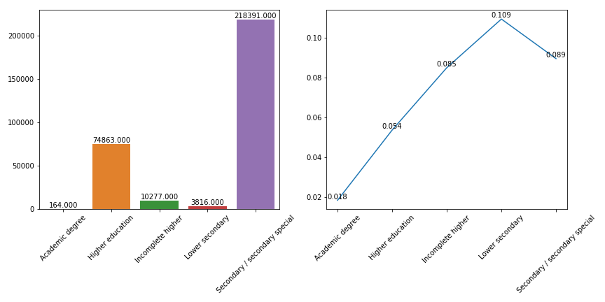
## NAME_FAMILY_STATUS(分类型变量)
### 统计量
有6个可选值，它们分别是：
* Single / not married : 45444
* Married : 196432
* Civil marriage : 29775
* Widow : 16088
* Separated : 19770
* Unknown : 2

缺失数量：0(0.00%)
频率最大的是：Married
### 频率图

## NAME_HOUSING_TYPE(分类型变量)
### 统计量
有6个可选值，它们分别是：
* House / apartment : 272868
* Rented apartment : 4881
* With parents : 14840
* Municipal apartment : 11183
* Office apartment : 2617
* Co-op apartment : 1122

缺失数量：0(0.00%)
频率最大的是：House / apartment
### 频率图

## ORGANIZATION_TYPE(分类型变量)
### 统计量
有58个可选值，它们分别是：
* Business Entity Type 3 : 67992
* School : 8893
* Government : 10404
* Religion : 85
* Other : 16683
* XNA : 55374
* Electricity : 950
* Medicine : 11193
* Business Entity Type 2 : 10553
* Self-employed : 38412
* Transport: type 2 : 2204
* Construction : 6721
* Housing : 2958
* Kindergarten : 6880
* Trade: type 7 : 7831
* Industry: type 11 : 2704
* Military : 2634
* Services : 1575
* Security Ministries : 1974
* Transport: type 4 : 5398
* Industry: type 1 : 1039
* ...

缺失数量：0(0.00%)
频率最大的是：Business Entity Type 3
### 频率图
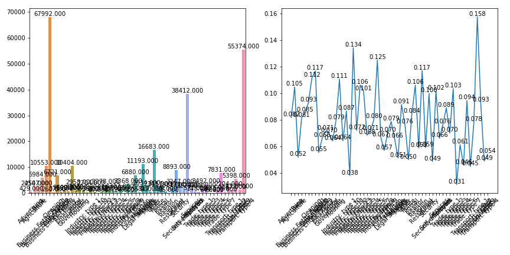
## WEEKDAY_APPR_PROCESS_START(分类型变量)
### 统计量
有7个可选值，它们分别是：
* WEDNESDAY : 51934
* MONDAY : 50714
* THURSDAY : 50591
* SUNDAY : 16181
* SATURDAY : 33852
* FRIDAY : 50338
* TUESDAY : 53901

缺失数量：0(0.00%)
频率最大的是：TUESDAY
### 频率图

## HOUR_APPR_PROCESS_START(分类型变量)
### 统计量
有24个可选值，它们分别是：
* 10 : 37722
* 11 : 37229
* 9 : 27384
* 17 : 14900
* 16 : 20385
* 14 : 27682
* 8 : 15127
* 15 : 24839
* 7 : 9131
* 13 : 30959
* 6 : 5842
* 12 : 34233
* 19 : 3848
* 3 : 1230
* 18 : 9049
* 21 : 405
* 4 : 2090
* 5 : 3638
* 20 : 1196
* 22 : 150
* 1 : 86
* ...

缺失数量：0(0.00%)
频率最大的是：10
### 频率图

## NAME_TYPE_SUITE(分类型变量)
### 统计量
有7个可选值，它们分别是：
* Unaccompanied : 248526
* Family : 40149
* Spouse, partner : 11370
* Children : 3267
* Other_A : 866
* nan : 0
* Other_B : 1770
* Group of people : 271

缺失数量：1292(0.42%)
频率最大的是：Unaccompanied
### 频率图

## NAME_INCOME_TYPE(分类型变量)
### 统计量
有8个可选值，它们分别是：
* Working : 158774
* State servant : 21703
* Commercial associate : 71617
* Pensioner : 55362
* Unemployed : 22
* Student : 18
* Businessman : 10
* Maternity leave : 5

缺失数量：0(0.00%)
频率最大的是：Working
### 频率图

## OCCUPATION_TYPE(分类型变量)
### 统计量
有18个可选值，它们分别是：
* Laborers : 55186
* Core staff : 27570
* Accountants : 9813
* Managers : 21371
* nan : 0
* Drivers : 18603
* Sales staff : 32102
* Cleaning staff : 4653
* Cooking staff : 5946
* Private service staff : 2652
* Medicine staff : 8537
* Security staff : 6721
* High skill tech staff : 11380
* Waiters/barmen staff : 1348
* Low-skill Laborers : 2093
* Realty agents : 751
* Secretaries : 1305
* IT staff : 526
* HR staff : 563

缺失数量：96391(31.35%)
频率最大的是：Laborers
### 频率图

## FONDKAPREMONT_MODE(分类型变量)
### 统计量
有4个可选值，它们分别是：
* reg oper account : 73830
* nan : 0
* org spec account : 5619
* reg oper spec account : 12080
* not specified : 5687

缺失数量：210295(68.39%)
频率最大的是：reg oper account
### 频率图
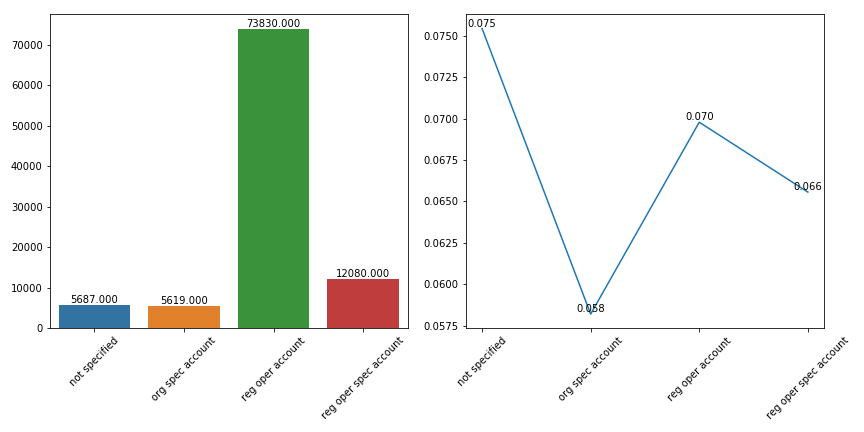
## HOUSETYPE_MODE(分类型变量)
### 统计量
有3个可选值，它们分别是：
* block of flats : 150503
* nan : 0
* terraced house : 1212
* specific housing : 1499

缺失数量：154297(50.18%)
频率最大的是：block of flats
### 频率图

## WALLSMATERIAL_MODE(分类型变量)
### 统计量
有7个可选值，它们分别是：
* Stone, brick : 64815
* Block : 9253
* nan : 0
* Panel : 66040
* Mixed : 2296
* Wooden : 5362
* Others : 1625
* Monolithic : 1779

缺失数量：156341(50.84%)
频率最大的是：Panel
### 频率图
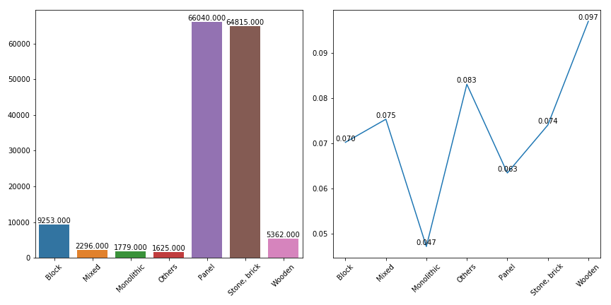
## FLAG_OWN_CAR(分类型变量)
### 统计量
有2个可选值，它们分别是：
* N : 202924
* Y : 104587

缺失数量：0(0.00%)
频率最大的是：N
### 频率图
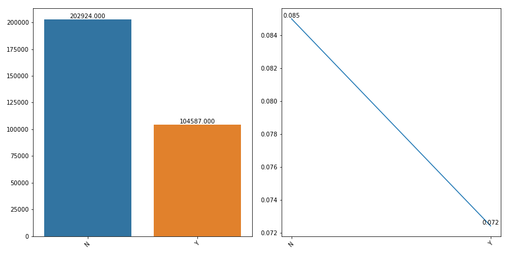
## FLAG_OWN_REALTY(分类型变量)
### 统计量
有2个可选值，它们分别是：
* Y : 213312
* N : 94199

缺失数量：0(0.00%)
频率最大的是：Y
### 频率图

## FLAG_DOCUMENT_2(分类型变量)
### 统计量
有2个可选值，它们分别是：
* 0 : 307498
* 1 : 13

缺失数量：0(0.00%)
频率最大的是：0
### 频率图

## FLAG_DOCUMENT_3(分类型变量)
### 统计量
有2个可选值，它们分别是：
* 1 : 218340
* 0 : 89171

缺失数量：0(0.00%)
频率最大的是：1
### 频率图
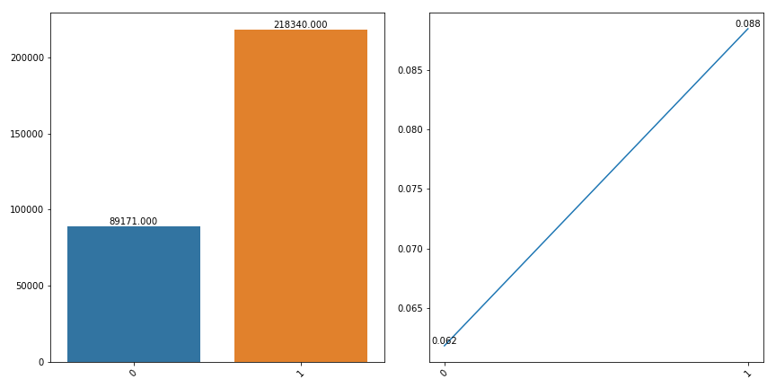
## FLAG_DOCUMENT_4(分类型变量)
### 统计量
有2个可选值，它们分别是：
* 0 : 307486
* 1 : 25

缺失数量：0(0.00%)
频率最大的是：0
### 频率图

## FLAG_DOCUMENT_5(分类型变量)
### 统计量
有2个可选值，它们分别是：
* 0 : 302863
* 1 : 4648

缺失数量：0(0.00%)
频率最大的是：0
### 频率图

## FLAG_DOCUMENT_6(分类型变量)
### 统计量
有2个可选值，它们分别是：
* 0 : 280433
* 1 : 27078

缺失数量：0(0.00%)
频率最大的是：0
### 频率图
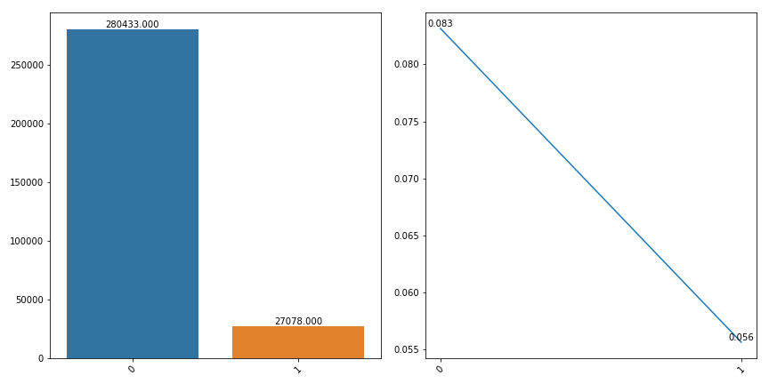
## FLAG_DOCUMENT_7(分类型变量)
### 统计量
有2个可选值，它们分别是：
* 0 : 307452
* 1 : 59

缺失数量：0(0.00%)
频率最大的是：0
### 频率图
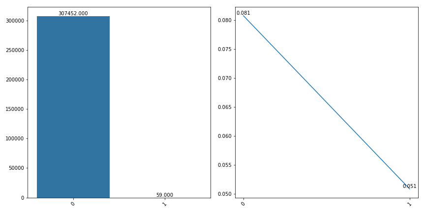
## FLAG_DOCUMENT_8(分类型变量)
### 统计量
有2个可选值，它们分别是：
* 0 : 282487
* 1 : 25024

缺失数量：0(0.00%)
频率最大的是：0
### 频率图

## FLAG_DOCUMENT_9(分类型变量)
### 统计量
有2个可选值，它们分别是：
* 0 : 306313
* 1 : 1198

缺失数量：0(0.00%)
频率最大的是：0
### 频率图

## FLAG_DOCUMENT_10(分类型变量)
### 统计量
有2个可选值，它们分别是：
* 0 : 307504
* 1 : 7

缺失数量：0(0.00%)
频率最大的是：0
### 频率图

## FLAG_DOCUMENT_11(分类型变量)
### 统计量
有2个可选值，它们分别是：
* 0 : 306308
* 1 : 1203

缺失数量：0(0.00%)
频率最大的是：0
### 频率图

## FLAG_DOCUMENT_12(分类型变量)
### 统计量
有2个可选值，它们分别是：
* 0 : 307509
* 1 : 2

缺失数量：0(0.00%)
频率最大的是：0
### 频率图

## FLAG_DOCUMENT_13(分类型变量)
### 统计量
有2个可选值，它们分别是：
* 0 : 306427
* 1 : 1084

缺失数量：0(0.00%)
频率最大的是：0
### 频率图
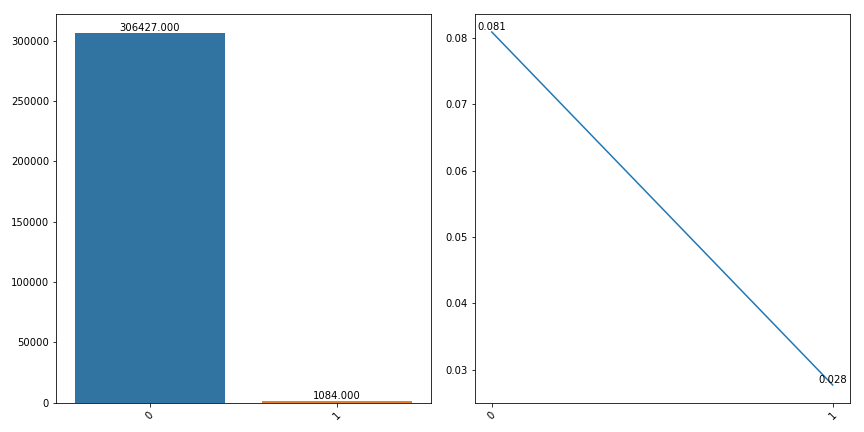
## FLAG_DOCUMENT_14(分类型变量)
### 统计量
有2个可选值，它们分别是：
* 0 : 306608
* 1 : 903

缺失数量：0(0.00%)
频率最大的是：0
### 频率图

## FLAG_DOCUMENT_15(分类型变量)
### 统计量
有2个可选值，它们分别是：
* 0 : 307139
* 1 : 372

缺失数量：0(0.00%)
频率最大的是：0
### 频率图

## FLAG_DOCUMENT_16(分类型变量)
### 统计量
有2个可选值，它们分别是：
* 0 : 304458
* 1 : 3053

缺失数量：0(0.00%)
频率最大的是：0
### 频率图
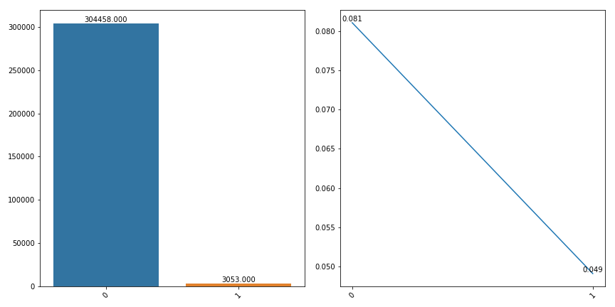
## FLAG_DOCUMENT_17(分类型变量)
### 统计量
有2个可选值，它们分别是：
* 0 : 307429
* 1 : 82

缺失数量：0(0.00%)
频率最大的是：0
### 频率图

## FLAG_DOCUMENT_18(分类型变量)
### 统计量
有2个可选值，它们分别是：
* 0 : 305011
* 1 : 2500

缺失数量：0(0.00%)
频率最大的是：0
### 频率图
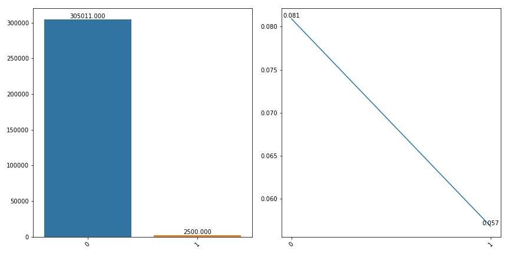
## FLAG_DOCUMENT_19(分类型变量)
### 统计量
有2个可选值，它们分别是：
* 0 : 307328
* 1 : 183

缺失数量：0(0.00%)
频率最大的是：0
### 频率图

## FLAG_DOCUMENT_20(分类型变量)
### 统计量
有2个可选值，它们分别是：
* 0 : 307355
* 1 : 156

缺失数量：0(0.00%)
频率最大的是：0
### 频率图

## FLAG_DOCUMENT_21(分类型变量)
### 统计量
有2个可选值，它们分别是：
* 0 : 307408
* 1 : 103

缺失数量：0(0.00%)
频率最大的是：0
### 频率图

## REG_REGION_NOT_LIVE_REGION(分类型变量)
### 统计量
有2个可选值，它们分别是：
* 0 : 302854
* 1 : 4657

缺失数量：0(0.00%)
频率最大的是：0
### 频率图
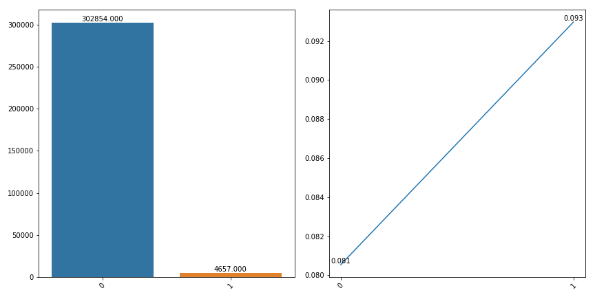
## REG_REGION_NOT_WORK_REGION(分类型变量)
### 统计量
有2个可选值，它们分别是：
* 0 : 291899
* 1 : 15612

缺失数量：0(0.00%)
频率最大的是：0
### 频率图
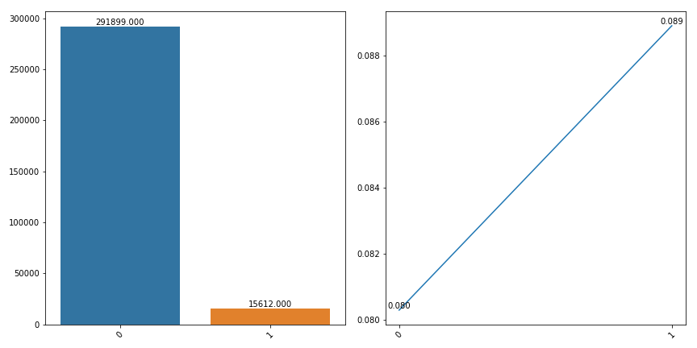
## LIVE_REGION_NOT_WORK_REGION(分类型变量)
### 统计量
有2个可选值，它们分别是：
* 0 : 295008
* 1 : 12503

缺失数量：0(0.00%)
频率最大的是：0
### 频率图

## REG_CITY_NOT_LIVE_CITY(分类型变量)
### 统计量
有2个可选值，它们分别是：
* 0 : 283472
* 1 : 24039

缺失数量：0(0.00%)
频率最大的是：0
### 频率图

## REG_CITY_NOT_WORK_CITY(分类型变量)
### 统计量
有2个可选值，它们分别是：
* 0 : 236644
* 1 : 70867

缺失数量：0(0.00%)
频率最大的是：0
### 频率图
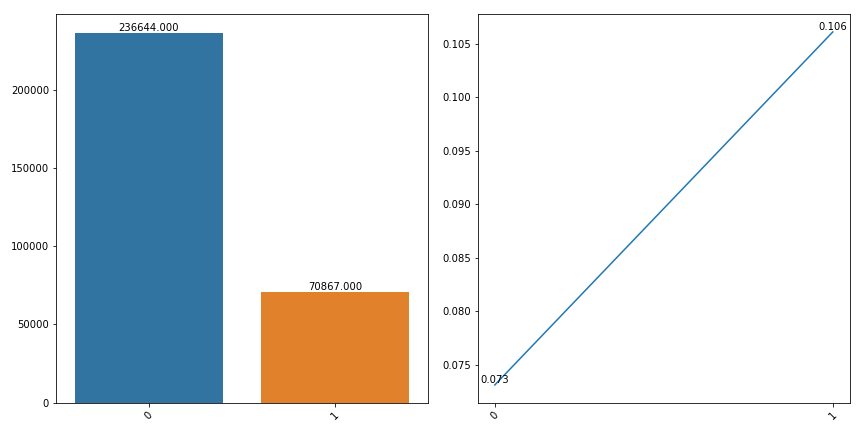
## LIVE_CITY_NOT_WORK_CITY(分类型变量)
### 统计量
有2个可选值，它们分别是：
* 0 : 252296
* 1 : 55215

缺失数量：0(0.00%)
频率最大的是：0
### 频率图
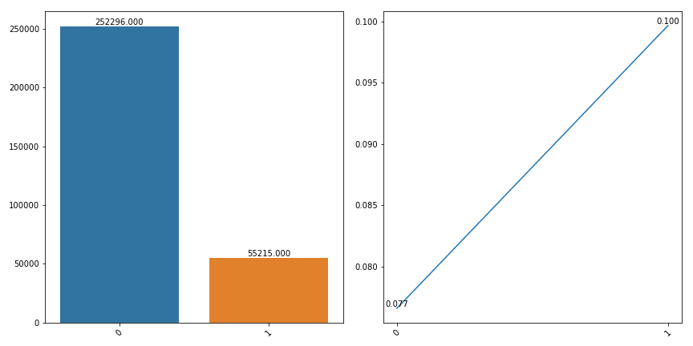
## FLAG_MOBIL(分类型变量)
### 统计量
有2个可选值，它们分别是：
* 1 : 307510
* 0 : 1

缺失数量：0(0.00%)
频率最大的是：1
### 频率图

## FLAG_EMP_PHONE(分类型变量)
### 统计量
有2个可选值，它们分别是：
* 1 : 252125
* 0 : 55386

缺失数量：0(0.00%)
频率最大的是：1
### 频率图

## FLAG_WORK_PHONE(分类型变量)
### 统计量
有2个可选值，它们分别是：
* 0 : 246203
* 1 : 61308

缺失数量：0(0.00%)
频率最大的是：0
### 频率图

## FLAG_CONT_MOBILE(分类型变量)
### 统计量
有2个可选值，它们分别是：
* 1 : 306937
* 0 : 574

缺失数量：0(0.00%)
频率最大的是：1
### 频率图

## FLAG_PHONE(分类型变量)
### 统计量
有2个可选值，它们分别是：
* 1 : 86431
* 0 : 221080

缺失数量：0(0.00%)
频率最大的是：0
### 频率图

## FLAG_EMAIL(分类型变量)
### 统计量
有2个可选值，它们分别是：
* 0 : 290069
* 1 : 17442

缺失数量：0(0.00%)
频率最大的是：0
### 频率图

## CODE_GENDER(分类型变量)
### 统计量
有3个可选值，它们分别是：
* M : 105059
* F : 202448
* XNA : 4

缺失数量：0(0.00%)
频率最大的是：F
### 频率图
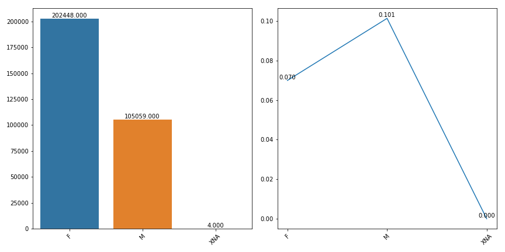
## EMERGENCYSTATE_MODE(分类型变量)
### 统计量
有2个可选值，它们分别是：
* No : 159428
* nan : 0
* Yes : 2328

缺失数量：145755(47.40%)
频率最大的是：No
### 频率图

